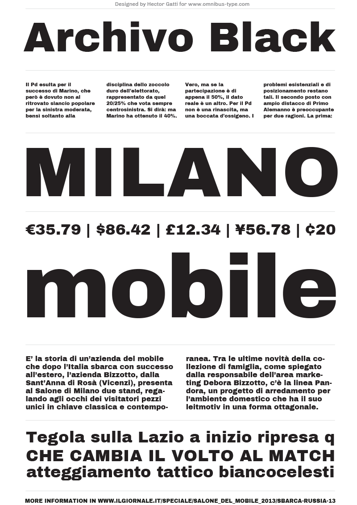

# Archivo Black

**Omnibus-Type**  
*SIL Open Font License, 1.1*

Archivo is a grotesque sans serif typeface family from [Omnibus Type](http://omnibus-type.com/). It was originally designed for highlights and headlines. This family is reminiscent of late nineteenth century American typefaces.

To contribute to the project contact [Omnibus Type](http://omnibus-type.com/).

### Designers

* Hector Gatti
* Pablo Cosgaya

### License

Copyright (c) 2012-2015, Omnibus-Type (www.omnibus-type.com omnibus.type@gmail.com).

Licensed under the [*SIL Open Font License, 1.1*](http://scripts.sil.org/OFL); you may not use this file except in compliance with the License.

======
## FONTLOG for the Archivo Black fonts

This file provides detailed information on the Archivo Black and Archivo Black One font software.  
This information should be distributed along with the Archivo Black fonts and any derivative works.

### Archivo Black is a typeface family that supports Unicode language range: 

* Basic Latin (95 glyphs),
* Latin-1 Supplement (96 glyphs),
* Latin Extended-A (128 glyphs),
* Latin Extended-B (7 glyphs),
* Spacing Modifier Letters (9 glyphs),
* Latin Extended Additional (8 glyphs),
* General Punctuation (23 glyphs),
* Superscripts and Subscripts (1 glyphs),
* Currency Symbols (4 glyphs),
* Letterlike Symbols (6 glyphs),
* Number Forms (4 glyphs),
* Arrows (7 glyphs),
* Mathematical Operators (17 glyphs),
* Miscellaneous Technical (4 glyphs),
* Alphabetic Presentation Forms (2 glyphs)

*To contribute to the project contact Omnibus-Type at omnibus.type@gmail.com*

**21 May 2017 (Nicolas Silva) Archivo Black v1.005**
- Added alternative ampersand

**27 January 2015 (Nicolas Silva) Archivo Black v1.004**
- Removed Reserve Font Name from the license
- Name tables adjusted
- fsType Installable mode
- Set Panose values

**11 Jun 2014 (Nicolas Silva) Archivo Black v.1.004**
- Redrew numbers and other glyphs:  
onehalf, onequarter, threequarters, florin, percent, perthousand, product, summation, copyright, estimated, literSign, registered.
- Improved kerning in Uppercase next to lowercases
- Improved contextual ligatures OT feature
- Drew bold and bolditalic versions
- TTF Autohint 1.0
- Optimized TTF curves

**02 Oct 2012 (Omnibus Type) Archivo Black v1.002**
- Fixed Tables name *Thanks Theunis de Jong for his technical input*

**22 Aug 2012 (Omnibus Type) Archivo Black v1.001**
- Initial release under SIL Open Font License
- This release supports the following:

Block              | Range
-------------------|--------------
Basic Latin        | U+0020-U+007E
Latin-1 Supplement | U+00A0-U+00FF
Latin Extended-A   | U+0100-U+017F

 
- Character map to support MS Codepages:  
  - 1252 Latin-1
  - 1250 Latin-2 (Easter Europe)
  - 1254 Turkish
  - 1257 Windows Baltic
  - Mac Roman

### Acknowledgements

If you make modifications be sure to add your name (N), email (E), web-address
(if you have one) (W) and description (D). This list is in alphabetical order.

**N:** **Hector Gatti**  
**E:** omnibus.type@gmail.com  
**W:** http://www.omnibus-type.com  
**D:** Designer

**N:** **Nicolas Silva**  
**E:** omnibus.type@gmail.com  
**W:** http://www.omnibus-type.com  
**D:** Typeface development  

**N:** **Pablo Cosgaya**  
**E:** omnibus.type@gmail.com  
**W:** http://www.omnibus-type.com  
**D:** Designer